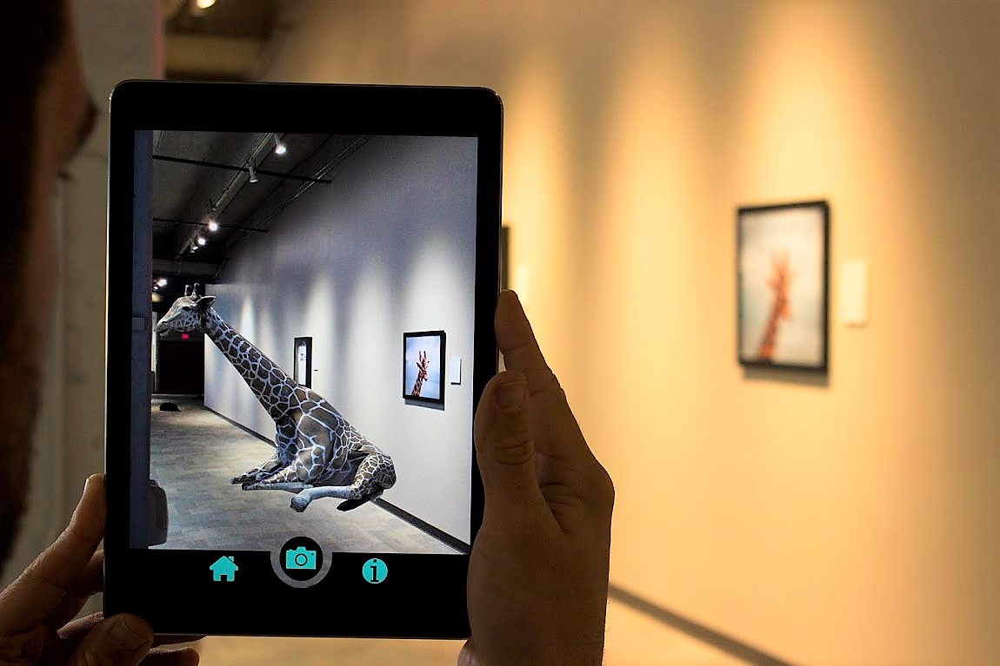

# Augmented Reality Museum

Project Description
The Augmented Reality (AR) Museum Experience is a cutting-edge project that revolutionizes the traditional museum visit by seamlessly blending the physical and digital worlds. This project aims to provide museum-goers an immersive and interactive journey, enhancing their understanding and appreciation of exhibits through augmented reality technology.

Using Unity 3D, I have created a museum AR application that contains two laser-scanned objects. To develop the AR application, I have used Google ARCore for Android or iOS using the Unity XR plug-in framework. The main idea is to create the ability to hold a museum object in your hand. Then, you should change the objects with a click and add sound and text to describe the object selected.
Source of museum artefacts: Museum-Objects.rar

Key Features:
- Virtual Exhibits: Transform static exhibits into dynamic, virtual experiences through AR overlays, offering a deeper understanding of historical artifacts, artwork, and scientific displays.
- Interactive Learning: Engage users with interactive elements, such as 3D models, animations, and informational overlays, fostering a more educational and entertaining museum visit.
- Personalized Tours: Offer personalized AR-guided tours, allowing visitors to explore the museum at their own pace while receiving curated information tailored to their interests.
- Multi-Sensory Experiences: Use AR to create multi-sensory experiences, allowing users to hear historical context, view animated reconstructions, and virtually touch artifacts through haptic feedback.
- Collaborative Exploration: Facilitate collaborative experiences where users can share insights, discoveries, and AR content with fellow visitors in real-time.

How It Works:
- AR App: Visitors download the AR museum app on their smartphones or AR glasses.
- Scan and Discover: Users scan exhibits with their devices, triggering AR content associated with each exhibit.
- Interactive Overlays: AR overlays provide additional information, interactive elements, and multimedia content related to the exhibit.
- Personalized Guidance: Users can choose personalized tours, guiding them through exhibits based on their preferences and interests.

Use Cases:
- Historical Exhibits: Bring historical events to life with AR reconstructions, virtual artifacts, and immersive storytelling.
- Art Galleries: Enhance art appreciation by providing information about artists, art movements, and hidden details through AR.
- Science Museums: Make scientific concepts more accessible with 3D models, simulations, and interactive displays.
- Collaborative Learning: Facilitate group visits with synchronized AR content, encouraging collaborative exploration and learning.

The Augmented Reality Museum Experience redefines the museum visit, making it more engaging, educational, and memorable. By seamlessly integrating technology with cultural and historical exhibits, this project aims to cater to a diverse audience and create a new era of interactive and immersive museum experiences.

Run: 
Please check and download demo folder and run ARMuseum.apk.
