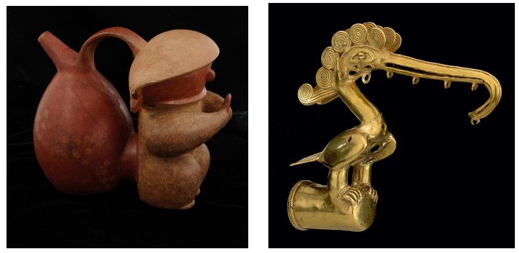

# Augmented Reality Museum

Using Unity 3D, I have created a museum AR application that contains two laser-scanned objects. To develop the AR application, I have used Google ARCore for Android or iOS using the Unity XR plug-in framework. The main idea is to create the ability to hold a museum object in your hand. Then, you should change the objects with a click and add sound and text to describe the object selected.
Source of museum artifacts: Museum-Objects.rar

Create VR Core project  
File > Build settings > select android > switch platform  
Player settings > other settings > remove Graphics API which is deprecated  
Player settings > other settings > scripting backend > IL2CPP  
Player settings > other settings > minimum API level > Level 24  
Player settings > other settings target architectures > check ARMv7 and ARM64  

Run: 
Please check and download demo folder and run ARMuseum.apk.